# Airflow

## Contents

- [Description](#description)
- [Airflow project structure](#airflow-project-structure)
- [DAGs structure](#dags-structure)
- [Local setup and run](#local-setup-and-run)
- [Troubleshooting](#troubleshooting)

## Description

## Airflow project structure

```
dags /                      contains DAGs
dags / configs /            contains JSON files with some configuration stuff used in DAGs
docker /                    contains Dockerfile and requirements.txt
variables_and_connections / contains JSON files with variables and connections to import on airflow-init step
```

## DAGs structure

Three DAGs are presented in this project:

- `crime_pipeline_dag`:

  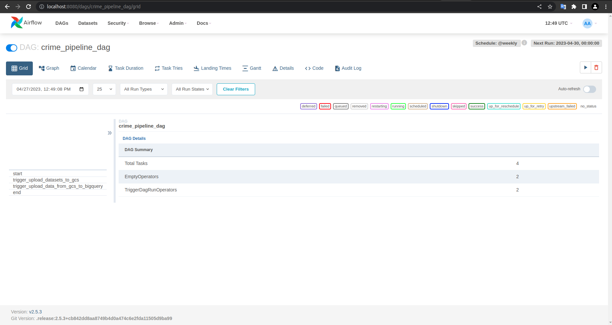
  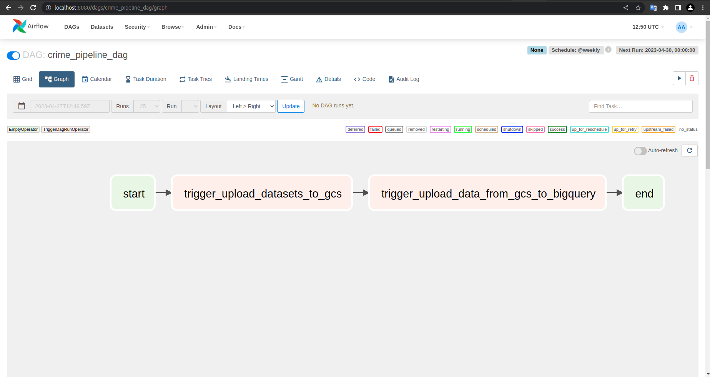

- `datasets_to_gcs_dag`:

  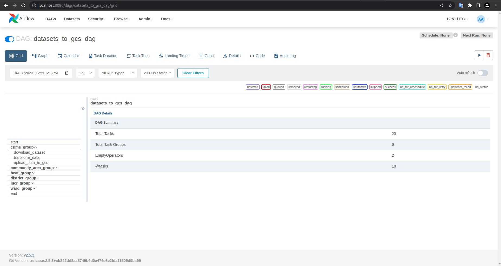
  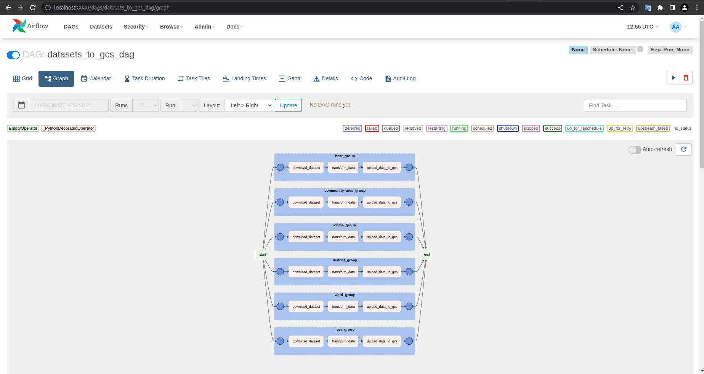

- `gcs_to_bigquery_dag`:

  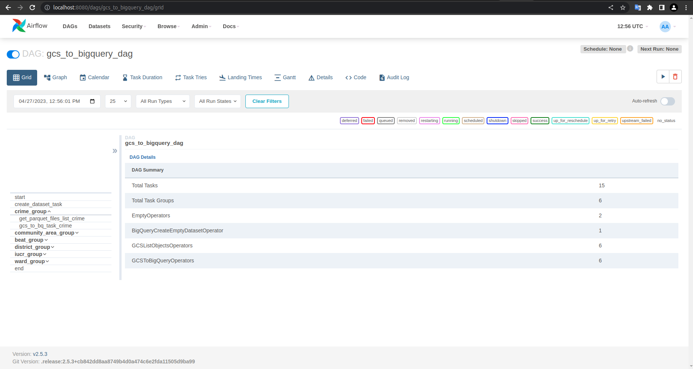
  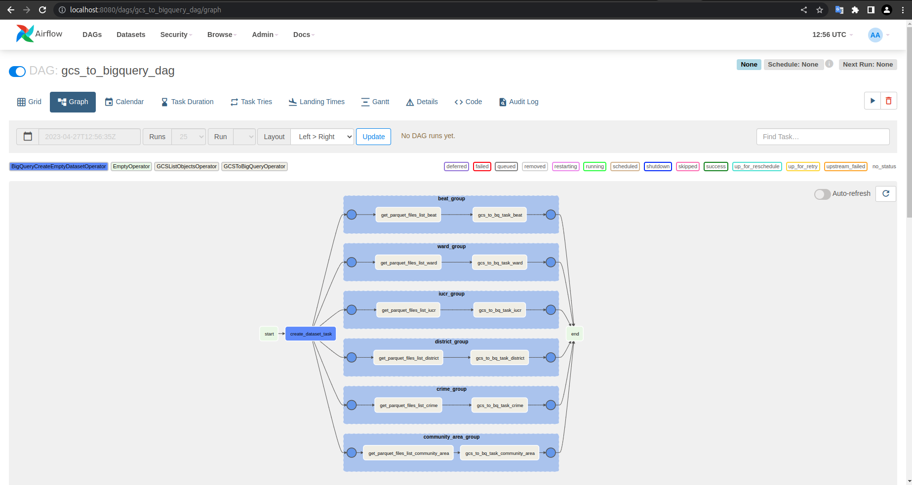


## Local setup and run

1. Run in terminal in project root directory:

`./create_airflow_env_file.sh && docker-compose -f airflow/docker-compose.yaml up --build`

2. Open browser and go to `localhost:8080` and use `airflow` as username and password:

   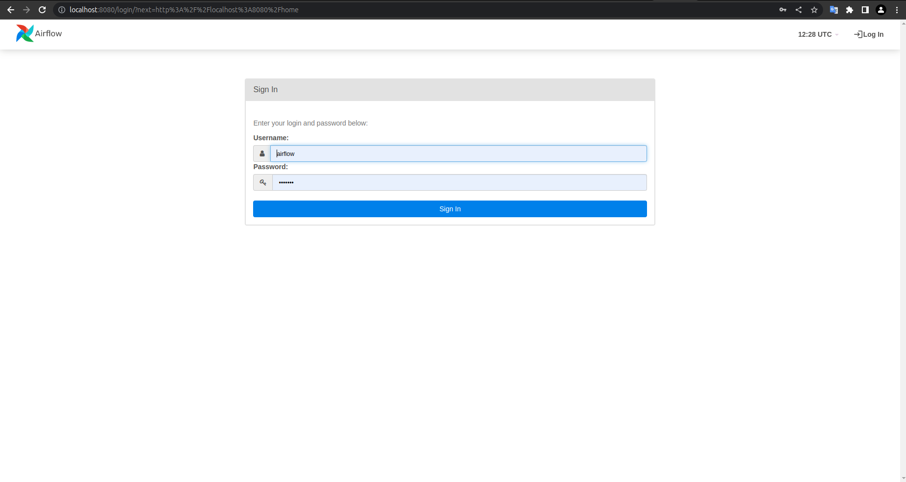

3. Now you see dags:

   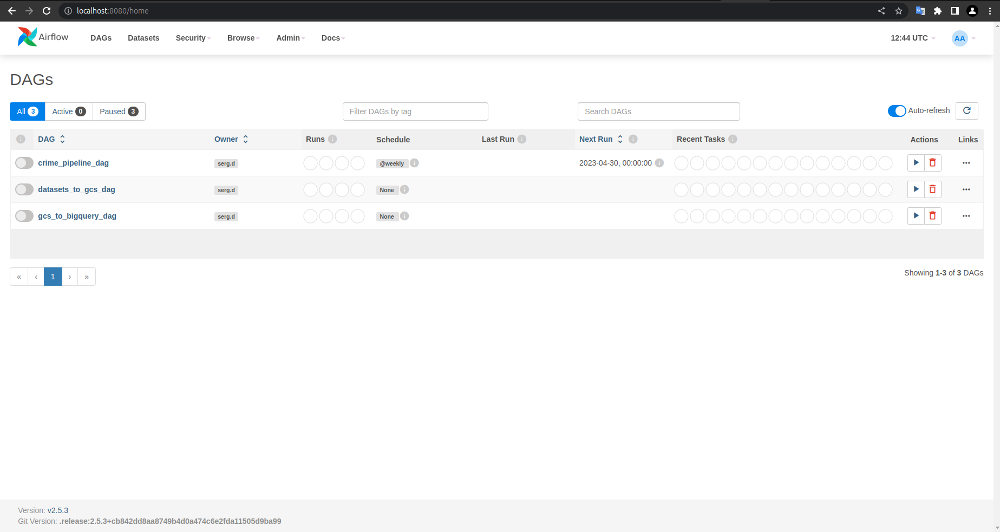

4. Unpause dags:

   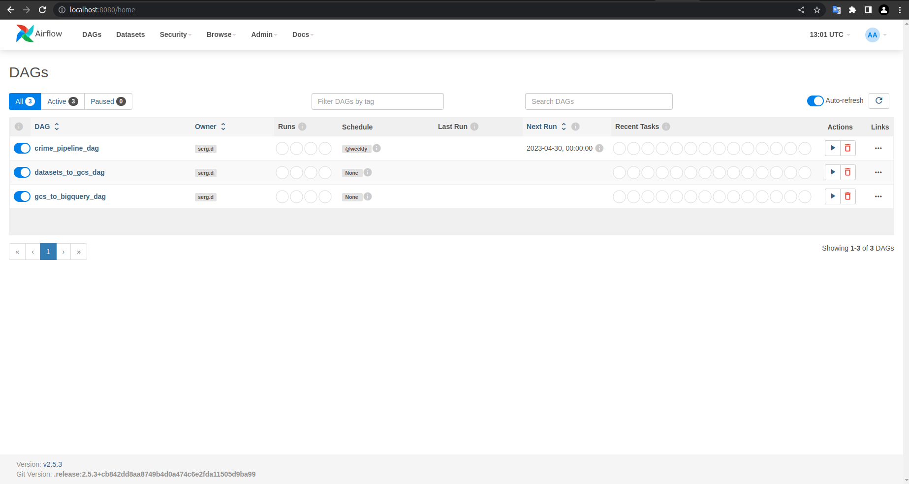

5. Due to schedule setting `@weekly` for `crime_pipeline_dag` you can trigger it manually:

   

6. Watch DAGs running:

   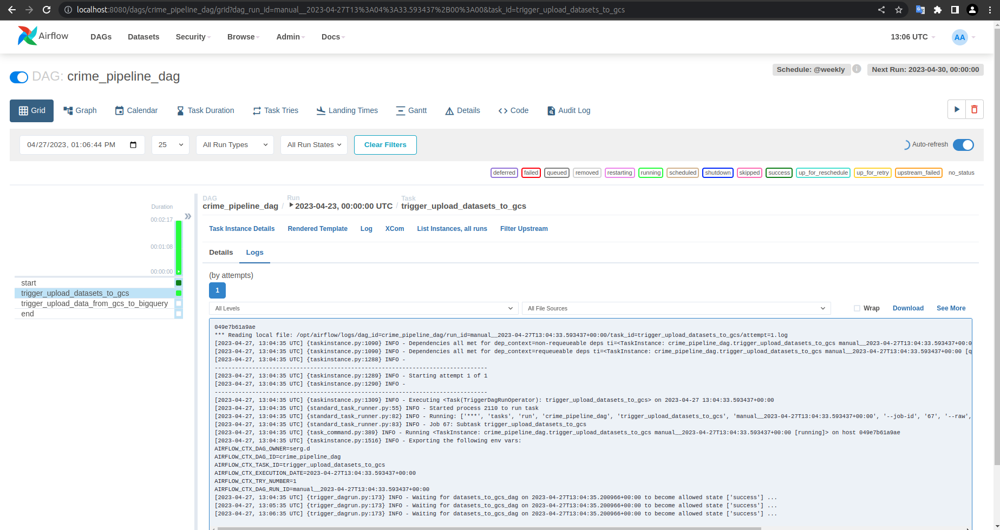
   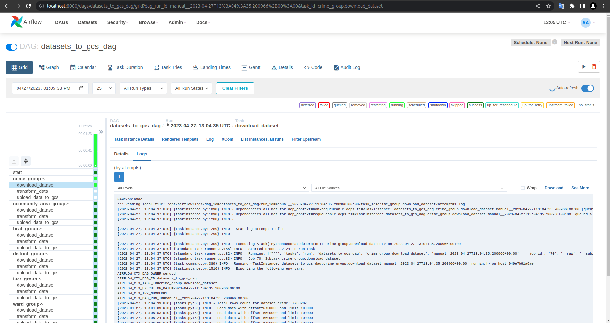

7. After completion see the results and logs:

   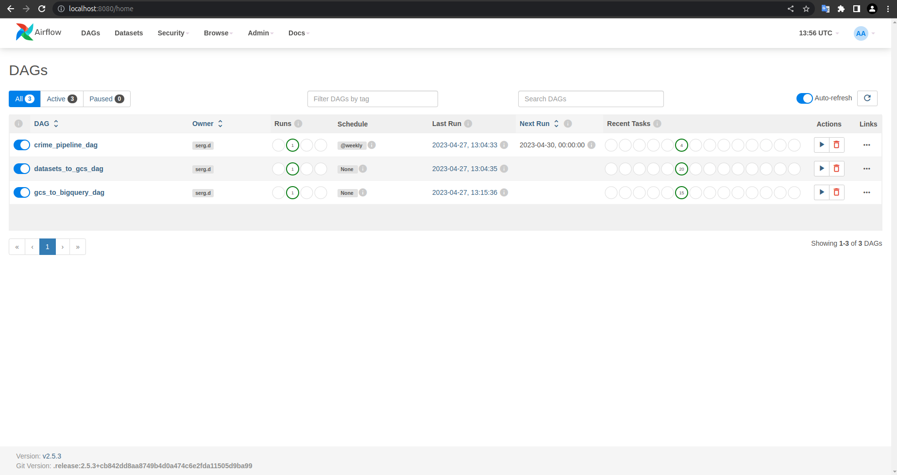
   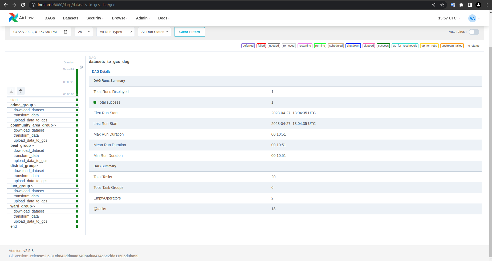
   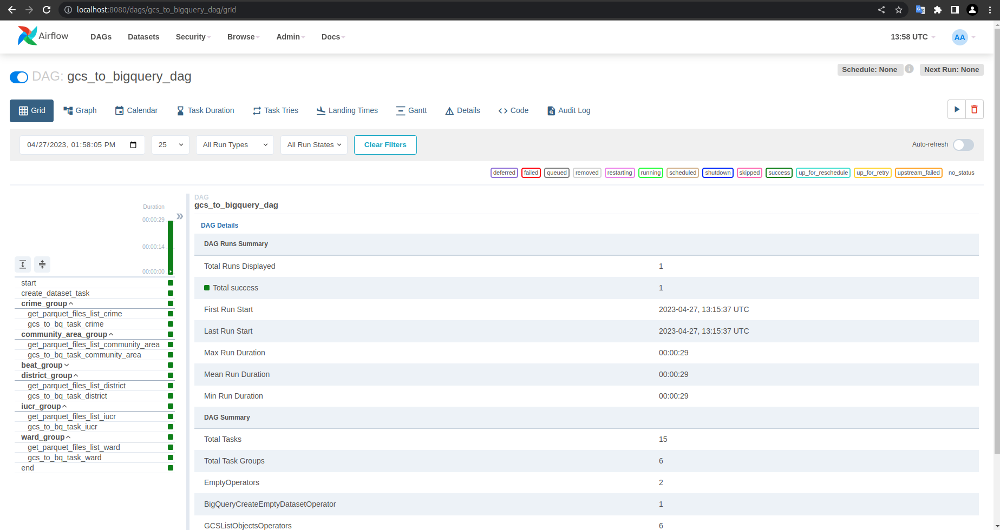

## Troubleshooting
    !TODO: add this section
