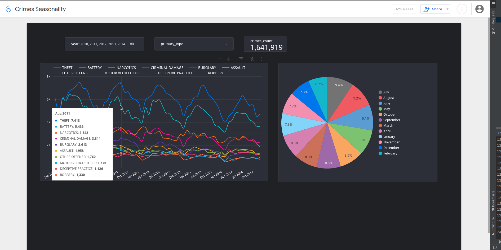
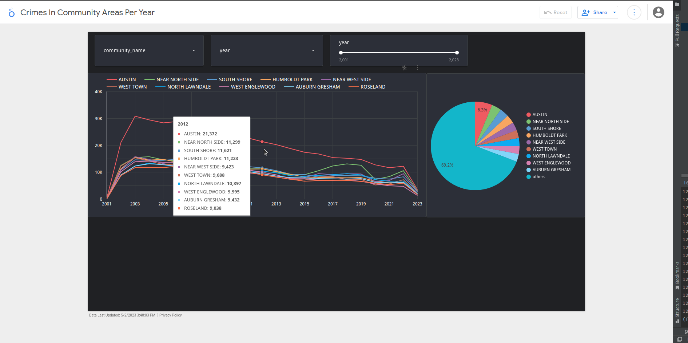

# Example dashboard №1:

[Dashboard 1](https://lookerstudio.google.com/reporting/a71b8ee4-252f-4c75-9bfa-4ce8e7e11ec9)

# Example dashboard №2:

[Dashboard 2](https://lookerstudio.google.com/reporting/3546551a-421e-4810-b918-0e385eaec764)

