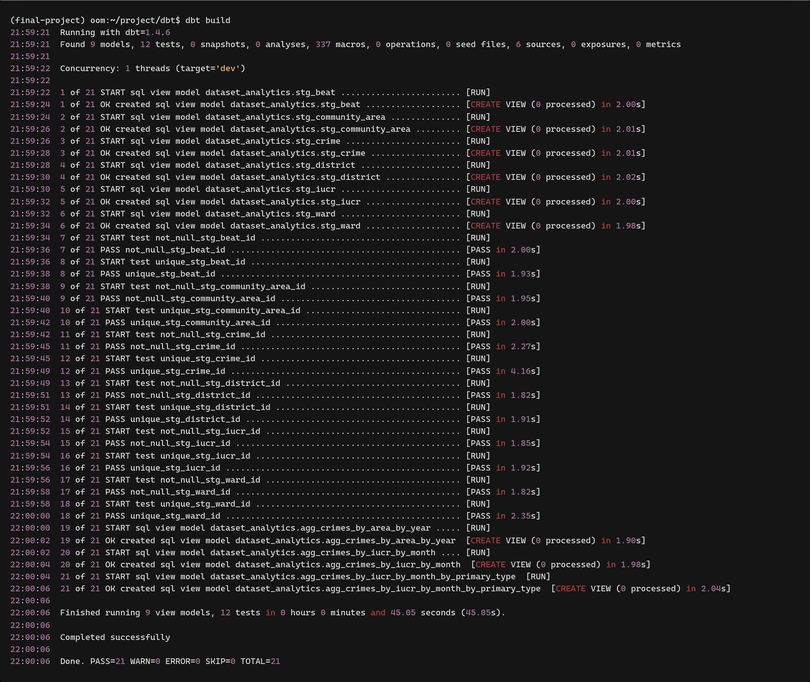
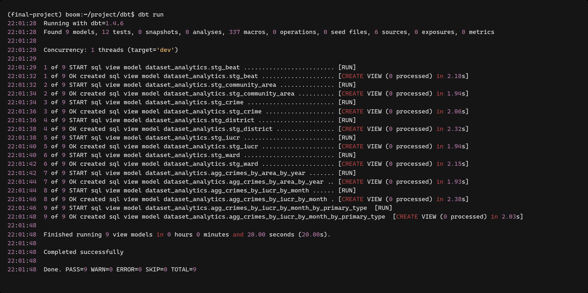
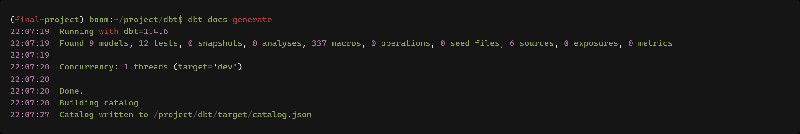
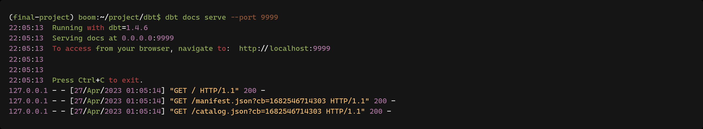
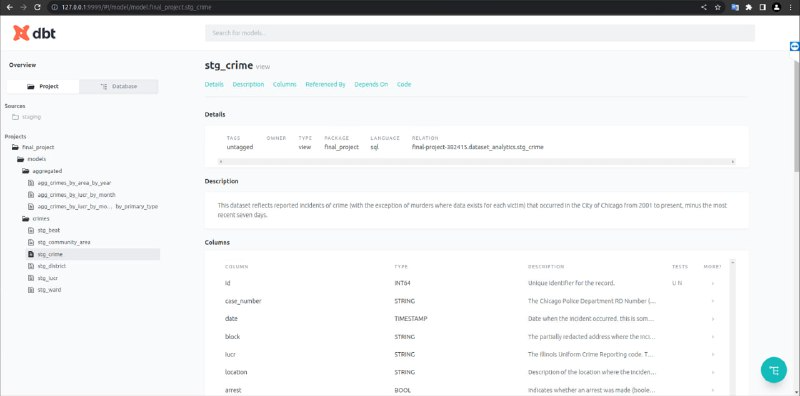

# DBT

## Prerequisites

1. Install dbt:
   `pip install dbt-bigquery`

## Use

1. Change project value and path to your credentials json in `profiles.yml`
2. Run `cd dbt`
   
3. Run `dbt build`
   
4. Run `dbt run`
   
5. To generate docs and see it in browser run `dbt docs generate`
   and then `dbt docs serve --port <port>` and open link `localhost:<port>`
   
   
   

### Resources:

- Learn more about dbt [in the docs](https://docs.getdbt.com/docs/introduction)
- Check out [Discourse](https://discourse.getdbt.com/) for commonly asked questions and answers
- Join the [dbt community](http://community.getbdt.com/) to learn from other analytics engineers
- Find [dbt events](https://events.getdbt.com) near you
- Check out [the blog](https://blog.getdbt.com/) for the latest news on dbt's development and best practices
