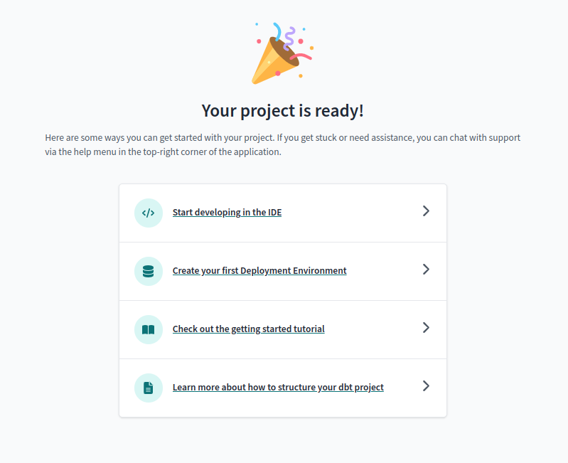

# DBT Docs
## Content:
- [Prerequisites](#prerequisites)
- [Local setup and run](#local-setup-and-run)
- [Setup in DBT Cloud](#setup-in-dbt-cloud)
- [Resources](#resources)

## Prerequisites:

1. Install dbt:
   `pip install dbt-bigquery`

## Local setup and run:

1. Change project value and path to your credentials json in `profiles.yml`
2. Run `cd dbt`:

   

3. Run `dbt build`:

   

4. Run `dbt run`:

   
   

5. To generate docs and see it in browser run `dbt docs generate`
   and then `dbt docs serve --port <port>` and open link `localhost:<port>`:

   
   
   

## Setup in DBT Cloud:

1. Create account in [getdbt.com](https://www.getdbt.com/) or login if you have one.
2. After login create a new account:

3. Choose a BigQuery connection:

4. Configure environment by uploading Service Account JSON file:

5. Choose dataset for models build and test connection:

6. Choose your repository on `Setup a Repository` step in dbt cloud:

7. Project is ready:

8. Due to existence of dbt project inside a subdirectory you need to set `Project subdirectory` setting:

- Go to the `Account Settings`:

  

- Tap on your project name:

  

- Click `Edit` button and set `Project subdirectory` to `dbt`:

  

- Click on `Save` button:

  

9. Go to `Develop` section and create new branch:

   

10. Enjoy:

    

### Resources:

- Learn more about dbt [in the docs](https://docs.getdbt.com/docs/introduction)
- Check out [Discourse](https://discourse.getdbt.com/) for commonly asked questions and answers
- Join the [dbt community](http://community.getbdt.com/) to learn from other analytics engineers
- Find [dbt events](https://events.getdbt.com) near you
- Check out [the blog](https://blog.getdbt.com/) for the latest news on dbt's development and best practices
