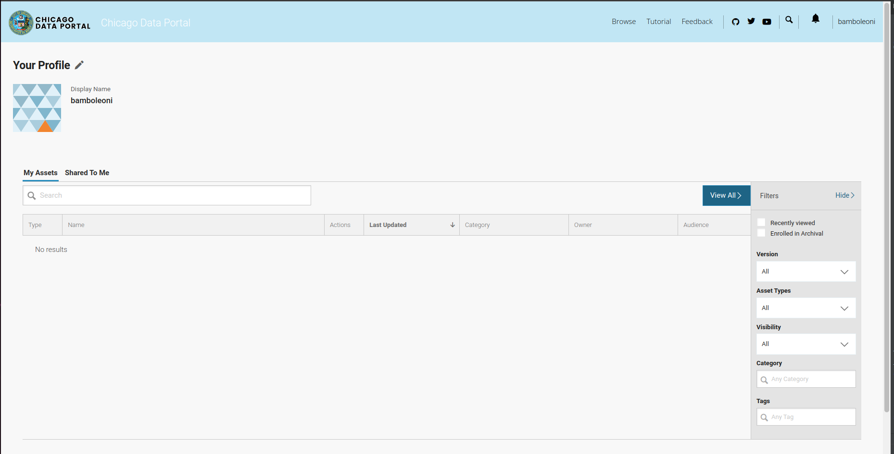
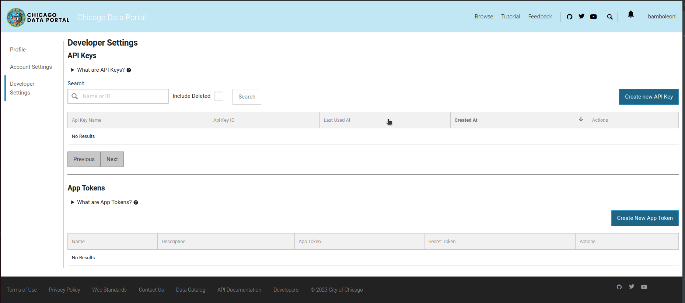
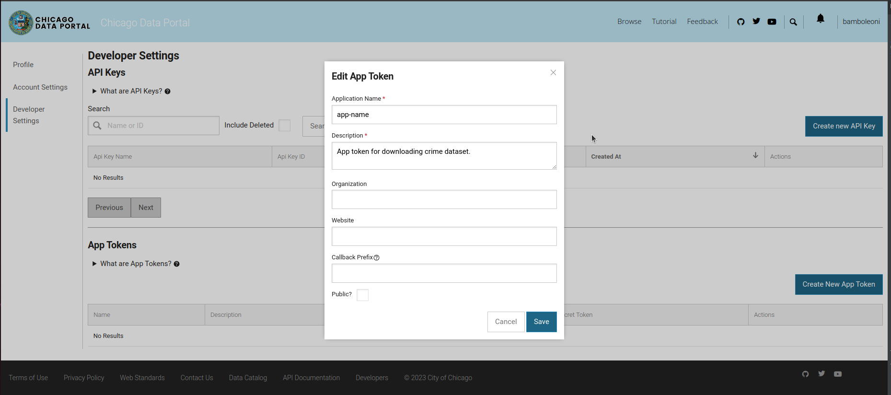
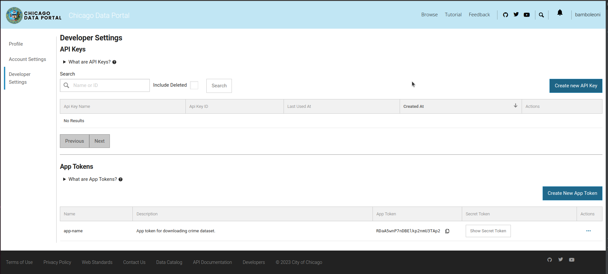
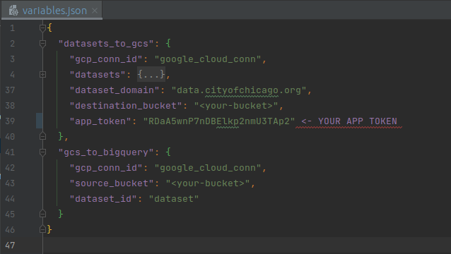
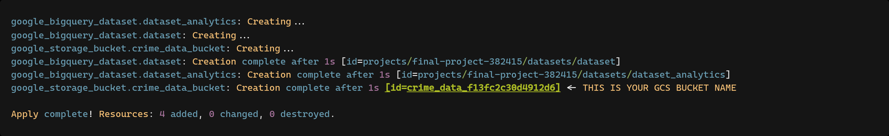
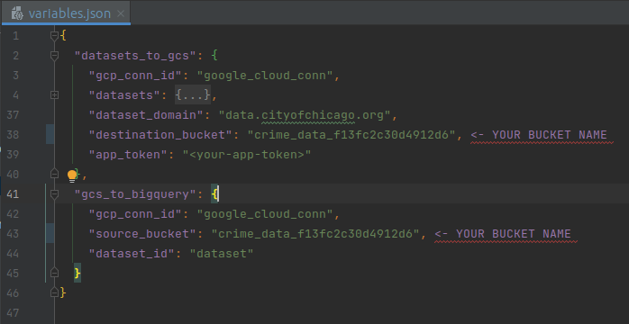

## Apps to install:

> `docker`
>
> `docker-compose`
>
> `terraform`

## App Token Creation

1. Register on [Chicago Data Portal](https://data.cityofchicago.org/signup)

2. Sign in:

   

3. Go to [Profile Edit | Developer Settings](https://data.cityofchicago.org/profile/edit/developer_settings) page:

   

4. Create new `App Token`:

   
   

5. Copy created `App Token` and put this value in file `airflow/variables_and_connections/variables.json` as a value
   for the `app_token` key:

   

## Set GCS Bucket Variable

1. Create infrastructure with `terraform` following this [instructions](/terraform/README.md#local-setup-and-run).
2. See logs and find the name of bucket created by `terraform`:

   

3. Copy the name of created bucket and put this value in file `airflow/variables_and_connections/variables.json` as a
   value
   for keys `destination_bucket` and `source_bucket`:

   
