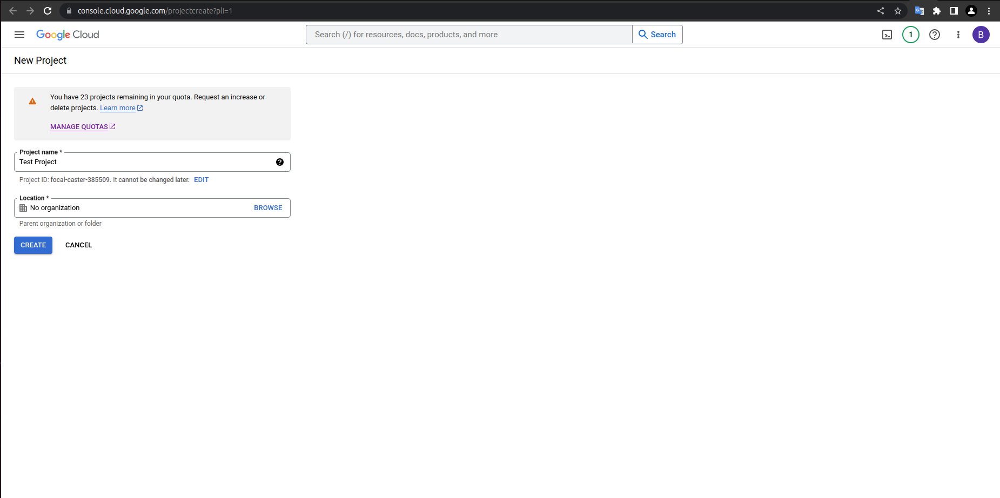

## Apps to install:

> `docker`
>
> `docker-compose`
>
> `terraform`

## Google Cloud Project

1. In the Google Cloud console, go to [Create a Project](https://console.cloud.google.com/projectcreate)

2. In the Project Name field, enter a descriptive name for your project.

   **Optional:** To edit the Project ID, click Edit. The project ID can't be changed after the project is created, so
   choose an ID that meets your needs for the lifetime of the project.

   

3. Click Create. The console navigates to the Dashboard page and your project is created within a few minutes.

   

4. After creation a project you have to create service account. Go
   to [Service Accounts](https://console.cloud.google.com/iam-admin/serviceaccounts) and choose your project:

   

5. Click on `CREATE SERVICE ACCOUNT`, enter the name and (optional) account ID and description and
   click `CREATE AND CONTINUE`:

   

6. Grant this service account access to project's `BigQuery` and `GCS` resources and data and click `CONTINUE`:

   

7. Click `DONE`:

   

8. Click on `Email` value of created account:

   

9. Go to `KEYS` section of the opened page and create new key:

   

   

   

10. After click on `CREATE` button the private key will be saved on your computer:

   

11. Now you have to copy this JSON file to the `credentials` folder of your cloned project and rename this file
    to `credentials.json`:

   

## App Token Creation

1. Register on [Chicago Data Portal](https://data.cityofchicago.org/signup)

2. Sign in:

   

3. Go to [Profile Edit | Developer Settings](https://data.cityofchicago.org/profile/edit/developer_settings) page:

   

4. Create new `App Token`:

   
   

5. Copy created `App Token` and put this value in file `airflow/variables_and_connections/variables.json` as a value
   for the `app_token` key:

   

## Set GCS Bucket Variable

1. Create infrastructure with `terraform` following this [instructions](/terraform/README.md#local-setup-and-run).
2. See logs and find the name of bucket created by `terraform`:

   

3. Copy the name of created bucket and put this value in file `airflow/variables_and_connections/variables.json` as a
   value
   for keys `destination_bucket` and `source_bucket`:

   
