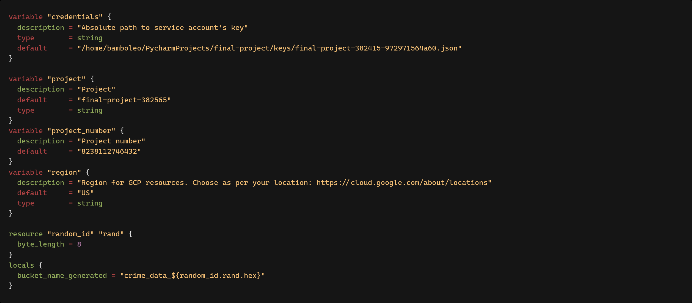
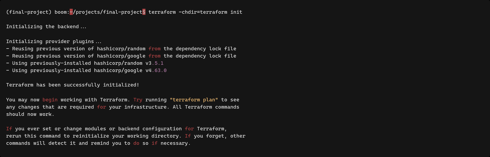
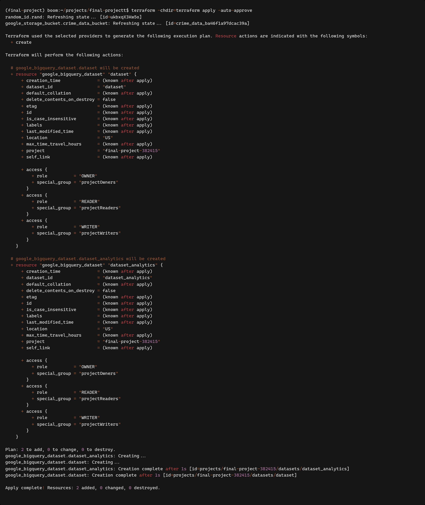

# Usage
## Prerequisites
Install terraform
## Local setup and run
1. First change product number, product name and credentials path in `variables.tf`

2. Then run from root project directory `terraform -chdir=terraform init`

3. Run `terraform -chdir=terraform apply -auto-approve`

