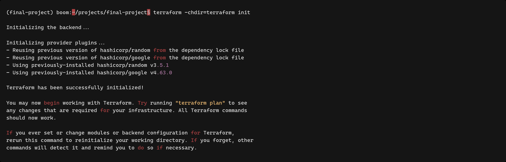
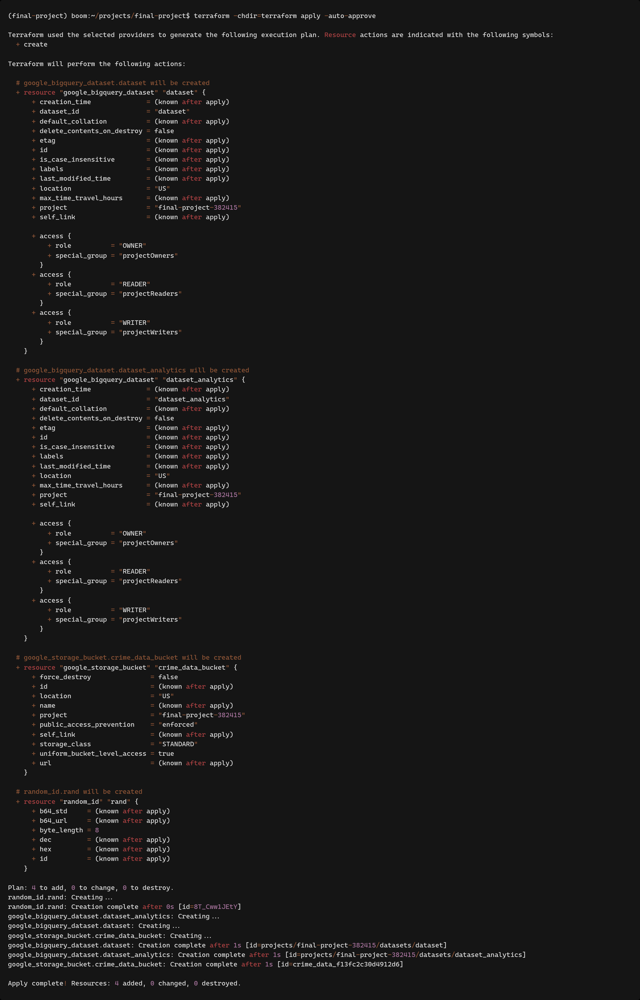
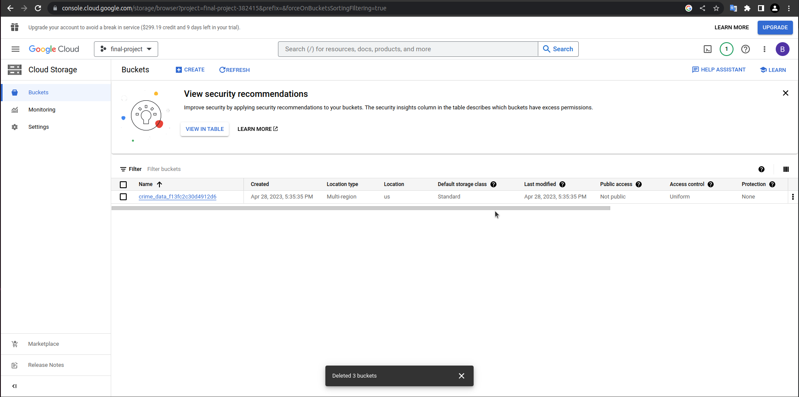
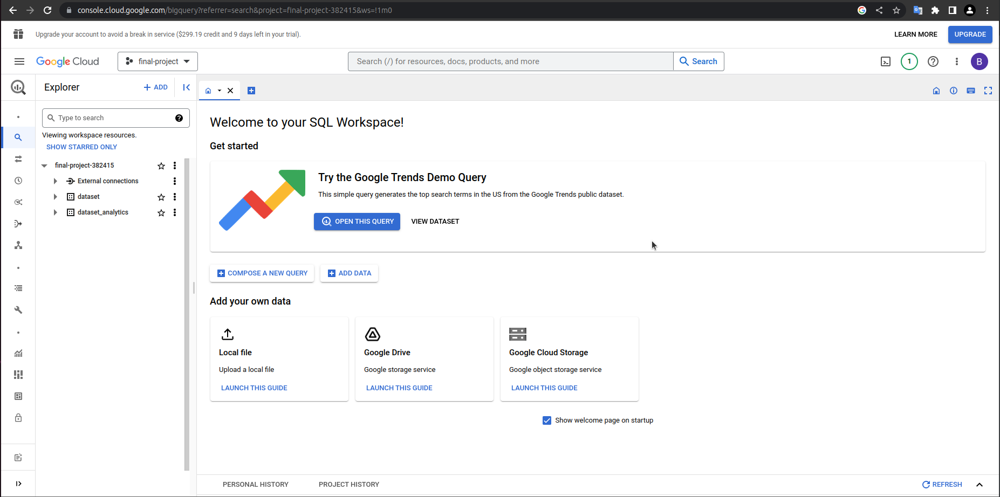

## Prerequisites

> **Warning**
>
> You have to put `credentials.json` into `credentials` folder in project directory.
>
> Create Project and Service Account following the [instructions](/docs/PREREQUISITES.md#google-cloud-project).

Install `terraform`

## Local setup and run

1. Run from root project directory `terraform -chdir=terraform init`:

   

2. Run `terraform -chdir=terraform apply -auto-approve`:

   

3. Check created resources in your project in GCP:

   
   
