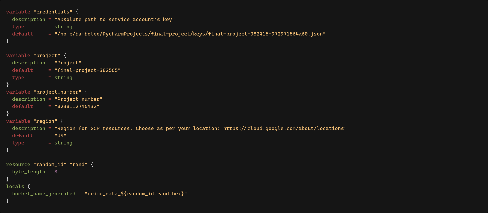

# Usage

## Prerequisites

Install `terraform`

## Local setup and run

1. First change product number, product name and credentials path in `variables.tf`:
   
    

2. Then run from root project directory `terraform -chdir=terraform init`:

   

3. Run `terraform -chdir=terraform apply -auto-approve`:

   

4. Check created resources in your project in GCP:

   
   
